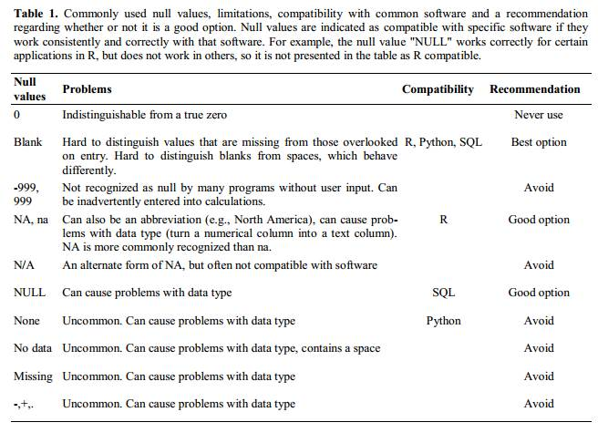

:::::::::::::::::::::::::::::::::::::: questions 

- How to represent data in tables

::::::::::::::::::::::::::::::::::::::::::::::::


::::::::::::::::::::::::::::::::::::: objectives

- Do's and don'ts in Excel
- Understand how good table organization aids data reusability.

::::::::::::::::::::::::::::::::::::::::::::::::

(10 min teaching if 1st exc skipped and done as demo)

Tables are a powerful and ubiquitous tool for storing and presenting information. We encounter them everywhere, from restaurant menus and bank statements to scientific databases. As biologists, we heavily rely on tables, often utilizing spreadsheets like Excel.

Excel offers ease of use, flexibility, and power. However, this very freedom can lead to bad practices that hinder data and metadata reusability. 


::::::::::::: challenge

## Exercise 1: What can go wrong with data in Excel (5 min)
We suggest the instuctor to go through problems, instead


 Have a look at the example [data-file](./files/04-bad-metadata.xlsx) in Excel.

 

This data resembles plant experiment results under various light conditions. Imagine you're tasked with working on this file. 

1. What aspects of this table appear confusing?
2. What clarifications would you seek from the original author before using this data?
3. How would calculating average biomass or biomass per genotype be problematic with this format?
4. Advanced data analysis often involves programmatic manipulation. This requires converting the data to a text format like CSV or TSV, or using libraries that can "read and convert Excel files on the fly."  Save this file in a text format, close Excel, and then reopen the saved file. What changes occur?

Have you encountered similar tables in your experience? Do you believe this example realistically reflects common issues?


::::::::::::: solution

## Solution

 This file hopefully unrealistically exacerbates typical bad practices in Excel.
 1+2. Some things that may be confusing:

* Why are there two tables, are the period measurement related to the metabolics i.e. same samples?
* Do colors in the period table have the same meaning? Seems no.
* Why can row 22 be read, whilst row 13 says error?
* What is the meaning of values in the media column?
* Are the genotypes the same in different blocks or not?
* What is the meaning behind bold text in the table?
* What is the definition of the terms/why are units missing/inconsistent?

3. *calculations*

* Biomass weights must be in the same unit before averaging. Any text entries need to be replaced with the appropriate value.
* Averaging biomass per genotype requires manually selecting relevant entries.

4. *saving to txt*

* Information about light conditions is entirely lost.
* Header column order might be scrambled.
* The update date format may change meaning depending on location (e.g., switching year and day order).

:::::::::::::
:::::::::::::

## Common Spreadsheet Errors 
(25 min teaching)

### <a name="tables"></a> 1. Using multiple tables

Multiple data tables within one spreadsheet can confuse both humans and computers:

* For humans, they can prompt finding associations where they are not present.
* For computers, each spreadsheet row is typically treated as one observation.

Additionally, you may potentially use the same field name in multiple places.

In our example, both column A and K named `sample` represent different information, and values in row 6 from both parts are not related.


### <a name="tabs"></a> 2. Using multiple tabs

Using multiple tabs might seem like an easy way to organize data, but it has its drawbacks:

* Tabs make it more difficult to perform programmatic analysis.
* Tabs can be ignored (under the radar) when opening files. For example, the recently used tab is shown first, and other users may not notice that there are many other tabs before it (we have seen this happen frequently when importing data).


However,

* Tabs seem like a perfect place to add administrative, descriptive metadata so they are next to data without "polluting" the data table.
* Having secondary data next to primary in subsequent tabs permits easy inspection of all without a need to always send a collection of files.

Our recommendation: Use tabs with caution; the more automatic analysis you do, the less frequently you should use tabs.

### <a name="zeros"></a> 3. Not filling in zeros

You might think that when you're measuring something and it's usually a zero, like the number of times a rabbit is observed in a survey, why bother writing in the number zero in that column when it's mostly zeros?

However, there's a difference between a zero and a blank cell in a spreadsheet. To the computer, a zero is data - you measured or counted it. A blank cell means that it wasn't measured, and the computer will interpret it as an unknown value (otherwise known as a null value).

Spreadsheets or statistical programs will likely misinterpret blank cells that you intend to be zeros.

Because of this, it's very important to record zeros as zeros and truly missing data as nulls.


### <a name="null"></a> 4. Using problematic null values

For example: using -999, -1, or 0 (other numerical values) to represent missing data.

Other times, different null values are used to convey different reasons why the data isn't there. For example, -1 for not recorded, -2 for contamination, etc.

This is important information to capture, but effectively uses one column to capture two pieces (real values and comment or status). It would be good here to create a new column like 'data_missing' and use that column to capture the different reasons.

Whatever the reason, it's a problem if unknown or missing data is recorded as -999, 999, or 0. Many statistical programs will not recognize that these are intended to represent missing (null) values.

It is essential to use a clearly defined and consistent null indicator. Blanks (most applications) and NA (for R) are good choices.

White et al. (2013) explain good choices for indicating null values for different software applications in their article: [Nine simple ways to make it easier to (re)use your data.](https://peerj.com/preprints/7/) Ideas in Ecology and Evolution.





### <a name="formatting"></a> 5. Using formatting to convey information organizing data

Never highlight cells, rows, or columns that should be excluded from an analysis, or to mark particular properties/conditions.

In our example file, information about light conditions is only encoded as a color. Formatting information is not available to analysis software and almost certainly will be lost during processing.

All the information should be encoded as a field value, for example, in columns like:  
condition, calibrated,  
validated, omitted, etc.

You can still use colors/fonts to help with readability (just make sure they help and don't distract) but no information should be lost if data is exported to plain text.

If you are not careful, formatting a worksheet to be more aesthetically pleasing can compromise your computer's ability to see associations in the data.

**Never merge cells, as it will make your data unreadable by statistics software**.

Don't leave blank rows to indicate separations in data


### <a name="units"></a> 6. Placing comments or units in cells

Most analysis software can't see Excel or LibreOffice comments,
and would be confused by comments placed within your data cells.

As described above for formatting, create another field if you need to add notes to cells.

Similarly, don’t include units in cells: ideally, all the measurements you place in one column
should have the same unit, but if for some reason they don't, create another field and specify the unit.
A field value `0.123 g` will need to be parsed by a script into `0.123` and `g` in order to be used
for calculations, don't add extra work for others.


### <a name="info"></a> 7. Entering more than one piece of information in a cell

Don't include more than one piece of information in a cell (like `M30`, `F25`, for male age 30 and female 25,
or `Red light + Ampicilin + High nitrogen`).

This will limit the ways in which you can analyze your data.
Design your data sheet to include this information. For example, include one column for age of
individuals and a separate column for sex.

### <a name="consistency"></a> 8. Inconsistency in used values

Using "synonyms" or alternatives to describe the same values.

For example: `E. Coli`, `EColi`, `Escherichia coli` in the same table

### <a name="field_name"></a> 9. Using problematic field names

Choose descriptive field names, but be careful not to include spaces, numbers, or **special characters** of any kind (including national characters: óęłńöüä).
Spaces can be misinterpreted by parsers that use whitespaces as delimiters and
some programs don’t like field names that are text strings starting with numbers (e.g. Excel).

Underscores (`_`) are a good alternative to spaces.
Consider writing names in camel case (like this: ExampleFileName) to improve
readability.

Remember that abbreviations that make sense at the moment may not be so obvious in 6 months,
but don't overdo it with names that are excessively long.

Including the units in the field names avoids confusion and enables others to readily interpret your fields.
Or add a separate row to help automatic unit conversions.

**Examples**

<table align = "left" style = "width =50%; border: 1px solid black;">
<tr>
	<td> <b>Good Name</b></td> <br />
	<td> <b>Good Alternative </b> </td><br />
	<td> <b>Avoid </b></td><br />
</tr>
<tr>
	<td> Max_temp_C</td>
	<td> MaxTemp </td>
	<td> Maximum Temp (°C) </td>
</tr>
<tr>
	<td> Precipitation_mm</td>
	<td> Precipitation</td>
	<td> precmm </td>
</tr>
<tr>
	<td> Mean_year_growth</td>
	<td> MeanYearGrowth </td>
	<td> Mean growth/year</td>
</tr>
<tr>
	<td> sex </td>
	<td> sex </td>
	<td> M/F </td>
</tr>
<tr>
	<td> weight </td>
	<td> weight </td>
	<td> w.</td>
</tr>
<tr>
	<td> cell_type </td>
	<td> CellType </td>
	<td> Cell Type </td>
</tr>
<tr>
	<td> Observation_01 </td>
	<td> first_observation</td>
	<td> 1st Obs</td>
</tr>
</table>  


### <a name="special"></a> 10. Using special characters in data

For example, when writing longer text in a cell, people often include line breaks, em-dashes,
etc in their spreadsheet.  Also, when copying data from applications such as Word, formatting and 'fancy' non-standard characters (such
as left- and right-aligned quotation marks) are included. When exporting this data into a coding/statistical environment or into a
relational database, dangerous things may occur,
such as lines being cut in half and encoding errors being thrown.

General best practice is to avoid adding characters such as new lines, tabs, vertical tabs and sadly, national characters.
In other words, treat a text cell as if it were a simple web form that can only contain text and spaces.


### <a name="metadata"></a> 11. Values without field labels

It may be obvious for us that a cell `Ann Smart and Daniele Hardwork` contains authors and
`Starch content in Arabidopis T. under different light conditions` is a title, but this is not obvious
for a computer program.

Always label values as the column header, or as a first field on the left:
```
Author  |  Ann Smart  |  Daniele Hardwork
Title   |  Starch content in Arabidopis T. under different light conditions
```

::::::::::::: challenge
## Exercise 2: Spotting problems 
(5 min + 4 talking)

 Look at the following rows and columns in the problematic table:

 * Row 5
 * Row 2
 * Column C
 * Column E
 * Column L
  

 which of the problems discussed above can you spot in these rows and column?

 Here, we list them again:  

  1. Using multiple tables
  2. Using multiple tabs
  3. Not filling in zeros
  4. Using problematic null values
  5. Using formatting to convey information and organizing data
  6. Placing comments or units in cells
  7. Entering more than one piece of information in a cell
  8. Inconsistency in used values
  9. Using problematic field names
  10. Using special characters in data
  11. Values without field labels

 Type the problem number(s) next to the table elements

::::::::::::: solution
## Solution

 * Row 5: 5, 9
 * Row 2: 11, 7
 * Column C: 8
 * Column E: 6, 5
 * Column L: 3
::::::::::::: 
::::::::::::: 


## Clean data tables make life easier 
(2 min teaching)


 Let's check the cleaned version of the previous [file](./files/04-better-metadata.xlsx).

 Look how easy it is to calculate the average biomas, and if you have Office365, see how
 easy it is to get average values per genotype.

 Do you think it would take more effort to record data in a cleaned way to start with,
 in comparison to the 'bad example' presented before?

 How long do you think it took to "clean" the original, problematic data?


::::::::::::: challenge
## Exercise 3: Outsmarted by Excel (4 min)


Excel has built in autoformatting functions which can make biologist's life more difficult

 ## Finding the right date

 Open Excel and type following values into the cells:

 | A    | B     | C      | D    | E      | F      |
 |------|-------|--------|------|--------|--------|
 | Gene | SEPT2 | Sample | 0013 | Record | 12/5/4 |
 | Mar1 | 1 March | Mar-1 | 1-3 |14/3/20 | 43904  |

 * Is what you see what you typed?
 * Can you force Excel to keep your formatting?
 * Do you know which year the dates represent?


::::::::::::: 

(7 min teaching)

A team of Australian researchers analyzed nearly 3,600 genetics papers [Ziemann 2016](https://doi.org/10.1186/s13059-016-1044-7).
As is common practice in the field, these papers all came with supplementary files
containing lists of genes used in research.

The Australian researchers found that roughly 1 in 5 of
these papers included errors in their gene lists that were due to Excel
automatically converting gene names to things like calendar dates or random numbers.

Those errors actually forced the renaming of 27 gene symbols
including SEPT4 (now SEPTIN4) and MARCH1 (now MARCHF1).

## Handling dates

Storing and handling dates can be problematic, even in programming languages, as we often encounter dates in various formats that are region-specific.

Have you ever been confused by a meeting date from an American collaborator?

When dealing with dates that represent "real" data, such as sample collection from a patient or field measurements, preventing misinterpretations is crucial. There are two safe options:

#### Store dates in three columns for year, month, and day:

| Year | Month | Day |
|------|-------|-----|
| 2021 | 3     | 16  |
| 2021 | 10    | 1   |

#### Or store the date as an [ISO](https://en.wikipedia.org/wiki/ISO_8601) string:
`YYYYMMDD` e.g., `20210316`  
`YYYY-MM-DD` e.g., `2021-03-16`

Even though the `YYYY-MM-DD` format is normally preferred, it may unfortunately be reformatted by Excel according to your locale when saving to text like .csv!

When using text files (.csv, .tsv), you should always document the format you are using to represent dates.


:::::::: callout

## To Use or Not to Use Excel

The Excel file format `.xlsx` is now open, widely used, and supported by external libraries, making it considered interoperable. Nowadays, it is admissible as being FAIR.

However, plain text files like comma or tab-separated values (.csv, .tsv) can be accessed without any special software. Data in a CSV file can also be easily imported into other formats and environments, such as SQLite and R. We are not tied to a certain version of a certain expensive program when we work with CSV files, so it is a good format to work with for maximum portability, interoperability, and endurance.

If such files are handled only with text editors or programmatically (R, Python), then they are a safer option as they prevent the autoformatting issues described before.

If you analyze your data with R or Python, or you know that your data are meant to be processed that way, you should be using text formats whenever possible, and as soon as you capture your data.

However, if you are used to only using Excel and so does your community, just keep using it. Just be aware of the possible pitfalls discussed, especially when working with gene or protein names and accession numbers.


:::::::: 

:::::::: callout

## Cleaning data with Open Refine

Data cleaning and reorganization can be time-consuming, but there are tools to make it easier. 

[OpenRefine](https://openrefine.org/) is a powerful option for tackling messy data. It can:

  * Clean your data: Remove errors and inconsistencies.
  * Transform your data: Convert it between different formats.
  * Extend your data: Enrich it with web services and external sources.

OpenRefine lets you tackle common data quality issues. For example, you can:

  * Merge synonyms: Standardize terms like `"E. Coli"`, `"EColi"`, and `"Escherichia coli"` into a single term.
  * Split values: Separate entries in a `"Name"` field into separate `"FirstName"` and `"LastName"` fields.

**Want to learn more?**

Check out this carpentry course specifically designed for ecologists: **Data Cleaning with OpenRefine for Ecologists: [https://datacarpentry.org/OpenRefine-ecology-lesson/](https://datacarpentry.org/OpenRefine-ecology-lesson/)**


:::::::: 

:::::::: challenge
## Exercise 4: Data tables and FAIR (4 min)

 Which of the following statements is true/false (T or F):

 *	Do’s and don’ts help in programmatic re-use:
 *	Avoiding multiple tabs improves interoperability:
 *	Having accompanying README file with a table description is not FAIR:
 *	No ‘spaces’ in columns headers improve readability:
 *	2022-07-15 is ISO date format:
 *	20220715 date format is better for excel than 2022-07-15:
 *	“No data” is better than leaving cell “blank” for missing data:
 
:::::::: solution
## Solution

 *	Do’s and don’ts help in programmatic re-use: T
 *	Avoiding multiple tabs improves interoperability: T
 *	Having accompanying README file with a table description is not FAIR: F
 *	No ‘spaces’ in columns headers improve readability: F
 *	2022-07-15 is ISO date format: T
 *	20220715 date format is better for excel than 2022-07-15: T
 *	“No data” is better than leaving cell “blank” for missing data: F
 
:::::::: 
:::::::: 


:::::::::: keypoints:
- Never use formatting to encode information
- Include only one piece of information in a cell
- It is easier to store data in the correct form than to clean data for reuse
:::::::::: 

