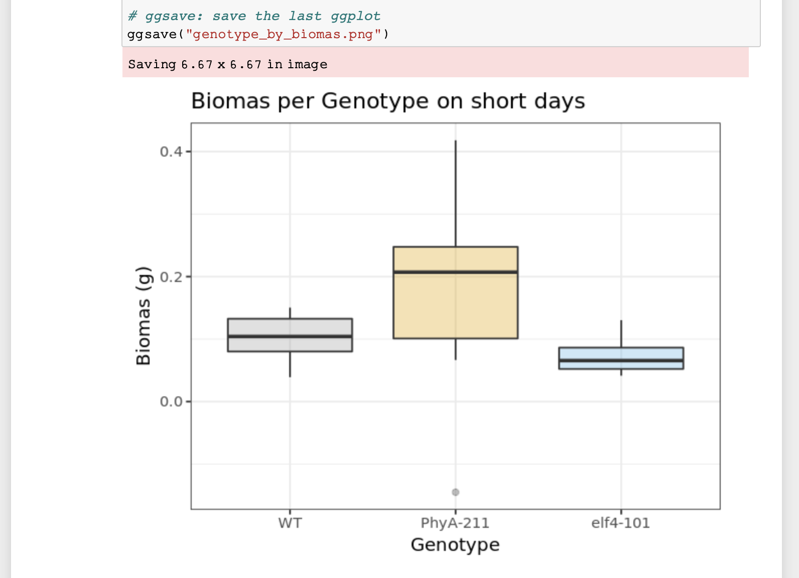

:::::::::::::::::::::::::::::::::::::: questions 

- How keep track of your data analysis procedure?
- How to make reproducible plots?
- What are Jupyter notebooks

::::::::::::::::::::::::::::::::::::::::::::::::


::::::::::::::::::::::::::::::::::::: objectives

- Recognise benefits of notebooks for analysis
- Use a jupyter notebook and modify it
- Understand notebooks role in being FAIR

::::::::::::::::::::::::::::::::::::::::::::::::


---
## Reusable Analysis
(~50 min teaching)


**Data analysis and research are inherently iterative.** 
Experimental measurements and their subsequent analysis guide the research journey.
For example, in drug discovery, analyzing initial data might reveal the need to switch targets if a current one proves unsuitable.
Similarly, with large datasets or omics experiments, initial exploration often necessitates adjustments to analysis methods and, potentially, the experimental procedures themselves.

This "**ad-hoc**" analysis, characterized by repeated exploration, refinement, and adaptation, is crucial for identifying suitable methods and parameters.
Only after multiple iterations does the process culminate in statistically validated results, ready for presentation in publications with accompanying graphs.  Traditional methods like pen and paper or spreadsheets struggle to effectively track this iterative nature of research.

## Reusable Computing
We have previously discussed electronic lab notebooks and their benefit in being FAIR.
If you are working with large datasets, mathematical models, complex visualisations of 
your data then you might already be frustrated by having to copy and paste your figures
into your electronic lab notebook after each iteration of new code (or generation in 
Excel). You might also have lost track of which code corresponded to which figure 
and why you changed your code last time.


There is a simple solution to this: **Computational notebooks**

## Computational Notebooks - Jupyter Notebook for FAIR practices

Just like traditional lab notebooks document experiments, **[Jupyter Notebooks](www.jupyter.org)** serve as digital workspaces for scientific computing. Instead of physical data like DNA gels, researchers can embed code, data visualizations (graphs), and explanations directly within the notebook. This free and popular tool offers several advantages:

* Interactive coding: Jupyter Notebooks allow writing and editing code in various languages like Python, R, or Julia (hence the name "Ju" + "Py" + "ter"). The results (calculations or graphs) appear instantly alongside the code.
* Integrated Documentation: Code snippets seamlessly blend with explanations, capturing the entire experimental workflow – from setup and analysis to results and visualizations.

**Interactive data exploration**:  Data scientists leverage this format to explore data through an iterative process. They can write code, view the output, modify it, and repeat, fostering an interactive loop between researcher and data.  
The huge benefit of such notebooks is that source code is mixed with documentation, thus
explaining experimental setup, analysis, results of tables and plots throughout.


As a basic principle Jupyter Notebooks run on a 'kernel' which is responsible in
execution of the code. Generally this 'kernel' can run on your computer or
you can use external servers to store and analyse your data. 


**Sharing and Collaboration**: Notebooks can be exported as PDF or HTML files for easy sharing. Additionally, services like [nbviewer](https://nbviewer.org/) allow rendering notebooks directly on GitHub, eliminating the need for software installation.

To show you how easy it is to work with Jupyter Notebooks, we have 
created an exercise an exercise where you'll explore real-world data from a plant experiment.

We'll analyze the phenotypes of Arabidopsis plants under short and long-day light conditions using R programming as an example. We will create some graphs and test whether there are differences between our genotypes of arabidopsis.

   
    The example notebook and data files can be found in instructors folders.  
    The most recent version are available via a separated github project:  
    [fair-jupyter](https://github.com/BioRDM/fair-jupyter)
   
::::::::::::::::::::::::::::::::::::::::::::::: challenge

## Exercise 1: basics of Jupyter notebooks (5 min)

 Navigate to the jupyter server, we
 will first show you how to duplicate a notebook and save it and how to
 run the code:

 1. Select the notebook titled 'student_notebook_light_conditions.ipynb'
 as depicted below and click 'Duplicate'. Confirm with Duplicate when you
 are asked if you are certain that you want to duplicate the notebook.
   *Figure 1. Duplicate a Jupyter notebook*

 1. A copy of the notebook has appeared with the suffix '-Copy' and a
 number (**Figure 2a**), select this notebook. Have a look around the
 notebook and explore its anatomy (**Figure 2**), you should see
 experimental details, an image, and code. If you click on separate parts
 of the notebook you can see that it is divided into individual cells
 (**Figure 2 e-g**) which are of varying type (Code, R in this case, or
 Markdown - **Figure 2d**). Hashtags are comments within the code and shall help you to interpret what individual bits of code do.

   
 *Figure 2. Anatomy of a Jupyter notebook: (a) depicts the name of the
 notebook, (b, c) are toolbars, (c) contains the most commonly used
 tools, (d) shows of what type - Markdown, Code etc... - the currently
 selected cell is, and (e-g) are examples of cells, where (e) shows the
 currently selected cell.*

 1. Change the title of the notebook (**a**) to your initials e.g. "student_notebook_light_conditions_IB"
 2. To Save the notebook click on the disk symbol in the toolbar (**c**).
 3. To run the code select the top cell of the notebook (**e**) - this is
 likely pre-selected already - and click "Run" in the tool bar (**c**). The
 selected cell jumps one cell down (**f**).
 4. To avoid having to press Run repeatedly until we are at the end of
 the code (try clicking Run two more times and see what happens), we will
 show you how to run all the code. In the top tool bar (**b**) click "Cell"
 and select "Run All". ("Cell > Run All".)
 5. If you have another look at the notebook you can see that a table,
 graph and outputs of statistical testing have been generated.

::::::::::::::::::::::::::::::::::::::::::::::: solution

 If you followed all steps correctly you should have reproduced the
 table, a graph and statistical testing. Apart from the pre-filled
 markdown text the rendered values of the code should look like this:
   
*Figure 3. Rendering of data frame*
   
*Figure 4. Rendering of plot*

:::::::::::::::::::::::::::::::::::::::::::::::
:::::::::::::::::::::::::::::::::::::::::::::::

::::::::::::::::::::::::::::::::::::::::::::::: challenge

## Exercise 2: how to add and remove content (3 min)

In your previously saved notebook, we will now show you how to add text
and remove cells within your notebook. Additionally we will show you how
to change code:

1. We want to change the author name to your name: Double click on the
cell containing the author name. You can see how the layout of the cell
changes into Markdown, and you can simply change the name.
2. Press the Run button in the toolbar and the Markdown of the cell will
be rendered again and you can see the text shows as previously.
3. We now want to add some details about the "light_results.txt" file
which is being loaded. To add a cell above the code, click the cell 
currently above the first lines of code and click the "+" in the toolbar.
This creates a cell below selected cell.
4. Now add a note about the file which is being loaded and the purpose
of the subsequent analysis: e.g. Loading of results following short- and
long-day light exposure on arabidopsis, followed by visualisation of
differences in chlorophyll/biomas etc... content between genotypes on 
short-days and long-days. To show the cell as Markdown and not code,
make sure "Markdown" is selected in the toolbar.
5. To remove a cell, select it and click on the scissors icon in the
toolbar (This can be undone under Edit > Undo Delete Cells).
6. To change the output of your graph click on the cell containing the
code below the "Visualise data" title. We want you to change the colours
of the box-plots. You can do this where the comment "# change colour of
groups" is written. Either you can use three different HEX codes (a
6-symbol code representing colours from white to black), or colours
simply by their name - e.g. dark blue, orange...
7. To save the graph under a different name add your initials to the
file name under which the image is being saved. Press Run again. Your
image should be visible in the overall file hierarchy.

::::::::::::::::::::::::::::::::::::::::::::::: 


(3 min teaching)

## Jupyter Notebooks are easy to use and great for collaborative efforts
Imagine your collaborators have shared this experiment measuring biomas of
*Arabidopsis* with you and you were able to duplicate and follow their
entire analysis from start to finish, including interpretation of data.
Now you are interested in analysing what biomas look like on long-days.
You are in luck! 

Because Jupyter Notebooks are so easy to handle you simply need to copy
and paste the already existing code your collaborators shared and adapt
variables such as short-day to long-day and change the names under which
figures are being saved to avoid duplication.

::::::::::::::::::::::::::::::::::::::::::::::: challenge
## Exercise 3: add another analysis step (10 min including walkthrough)

We have shown you how to manipulate text and code in Jupyter notebooks,
now we want you to add data visualisation (a graph) and stats for long-
day light condition:
1. Add additional cells including

* titles
* edited code to depict graph from long-days and not short-days
* Figure legend
* statistical testing of difference between genotypes on long-days
* interpretation of results of statistical testing.

::::::::::::::::::::::::::::::::::::::::::::::: solution

 ## Solution
 The following code will result in your new graph:
 
 ```
     ggplot(subset(df, light_condition %in% "LD"), 
     # subset only SD from >>light condition column for plotting
           mapping = aes(x = genotype, y = biomas, fill = genotype)) + 
     # x-axis shows genotype, y-axis shows biomas
        geom_boxplot(alpha=0.3) +
        labs(title = "Biomas per Genotype on long days",
            x = "Genotype", # Title of x-axis
            y = "Biomas (g)") + # Title of y-axis
        # change colour of groups
        scale_fill_manual(values=c("#999999", "#E69F00", "#56B4E9")) +
        theme_bw() +
        theme(legend.position="none")
 ```

The following code will result in testing of biomas between genotypes
in long-days - we assign a new variable to separate both analysis.

 ```
    res.aov.LD <- aov(biomas ~ genotype, data = subset(df, light_condition %in% "LD"))
    # Summary of the analysis
    summary(res.aov.LD)
```
 
The following code will result in Tukey multiple pairwise-comparison
testing.

```
     # conduct Tukey multiple pairwise-comparison
     TukeyHSD(res.aov.LD)
 ```
 
:::::::::::::::::::::::::::::::::::::::::::::::
:::::::::::::::::::::::::::::::::::::::::::::::

## Easy sharing of your notebook
We have now managed to not only reproduce code, but we were able to add to the analysis and interpretation of overall results. To show your PI and colleagues your results, you want to save the notebook in readable format.

::::::::::::::::::::::::::::::::::::::::::::::: challenge

## Exercise 4: Sharing of your Jupyter Notebook (5 min)
1. Download your Notebook (ensure all code has been run) as .html
2. View the documents and think about why it is important to run all code before download (try Cell > All Output > Clear and download your Notebook then and compare)

::::::::::::::::::::::::::::::::::::::::::::::: solution

It is important all code is run before the notebook is downloaded, as during download only the text and graphs are saved that are currently visible in your notebook.

::::::::::::::::::::::::::::::::::::::::::::::: 
::::::::::::::::::::::::::::::::::::::::::::::: 

The example notebook is extremely well documented to show the good practices when coding. Without such level of comments and explanations it may not be possible for new-commers to re-use this notebook.


## Plotting in R or Python

Both R and Python offer powerful tools for creating scientific plots, making them a natural starting point for many programmers. Compared to Excel, these languages enable the generation of:

* Professional visualizations: R and Python provide extensive libraries for creating publication-quality plots with a wider range of customization options.
* Reproducibility: Code-driven plots ensure consistent results and are easier to share and adapt for specific publication requirements.
* Scalability: Scripting allows for the efficient creation of multiple figures with consistent formatting, saving researchers time and effort.

Key benefits of using code for scientific plots:

* Customization: Precise control over every plot element (colors, fonts, axes, etc.) ensures adherence to specific journal formatting guidelines.
* Efficiency: Code facilitates the creation of complex plots or repetitive tasks, streamlining the workflow.


## Capturing the Ad-hoc Analysis Journey

Jupyter Notebooks excel at documenting the entire **exploratory data analysis (EDA)** process. They capture the rationale and decision-making behind your analysis, serving as a narrative alongside the code. 

**Key benefits of Jupyter Notebooks for EDA:**

* **Comprehensive Documentation:**  Markdown cells allow you to record:
    * Motivations and thought processes leading to the final results.
    * Details about input data usage.
    * Specific parameters and functions employed.
    * Intermediate results and adjustments made throughout the analysis.
* **Transparency and Reproducibility:**  By capturing all analytical steps, notebooks promote clear communication and ensure the analysis can be easily replicated.

**Maintaining Clean and Reusable Notebooks:**

While notebooks offer immense advantages, their effectiveness relies on **adherence to best practices**:

* **Meticulous Documentation:** Thoroughly document the decision-making process and the reasoning behind each step.
* **Data Transparency:** Clearly record details about the input data, including its source and any cleaning procedures applied.
* **Parameter Clarity:** Document the chosen parameters and their significance in the analysis.
* **Data Management:**  Strategically decide which data to retain and why, with clear annotations.
* **Code Clarity:** Employ clear and consistent coding practices, including meaningful variable and function names, and proper code formatting.
* **Self-Contained Notebooks:** Ensure your notebook is shipped with all necessary file inputs and a comprehensive description of the runtime environment.

**Strengths of Jupyter Notebooks:**

* **Orchestrating Analyses:** Notebooks efficiently manage step-by-step operations in R, Python, or even shell scripting (supporting all three languages simultaneously).
* **Parameter Management:**  They effectively capture and manage analysis parameters.
* **Interpretation and Insights:**  Notebooks facilitate the inclusion of interpretations and insights alongside the code, enriching the overall analysis.
* **Interactive Interface:**  They can function as a dynamic user interface, allowing users to modify parameters directly within the notebook based on the provided instructions.

**Limitations to Consider:**

* **Not a Replacement for IDEs:**  Jupyter Notebooks are not intended to fully replace Integrated Development Environments (IDEs). Complex, modularized code should be written in separate packages.
* **Unsuitable for Long Programs:**  While notebooks can handle smaller scripts, lengthy executable code is better suited for compilation into standalone modules.


::::::::::::::::::::::::::::::::::::::::::::::: challenge
## Exercise 5: Accessibility of Jupyter Notebooks (5 min)

 On a scale from -2 to 2, how do you feel about the following statements (R is interchangeable with Python), where -2 (strongly disagree), 0 no 
pinion to +2 strongly agree:

 * making graphs for a subset of data is easier in R than in Excel
 * it is easier to filter for data in R than in Excel
 * it is easier to apply formulas or calculations in R than in Excel
 * it is easier to generate a series of plots with similar layout in R than Excel
 * it is easier to do large scale data processing in R than in Excel
 * using notebooks does not require any programming knowledge
 * notebooks give you a better overview of your data processing than Excel
 * Jupyter is free, whilst a Microsoft Office (+Excel) suite costs $149.99, this alone is an incentive to use Jupyter notebooks as not all individuals have Microsoft Office supported by their employers
 * you need to learn R to do any data processing in notebook

::::::::::::::::::::::::::::::::::::::::::::::: 

## Computing in R and Python

Here's a revised version of the text about using R and Python for scientific computing:

**Starting Strong in R and Python**

While both R and Python are lauded for their flexibility and ease of use, this very characteristic can lead to the development of poor coding habits.  Their accessible nature can tempt users to prioritize quick results over well-structured, maintainable code.

To ensure a smooth journey into scientific computing, we recommend a phased approach:

1. **Grasp the Fundamentals:** Begin by mastering the creation of basic plots, data cleaning techniques, and data table manipulation.
2. **Solidify Software Engineering Principles:**  Next, delve into the core concepts of software engineering and establish best practices for writing clean and maintainable code.
3. **Progress to Advanced Analysis:**  Once a solid foundation is built,  gradually progress to tackling more complex analytical tasks, constructing data processing pipelines, and crafting comprehensive workflows.

**Addressing Environment Inconsistencies:**

A significant challenge with R and Python is their dependence on the specific libraries installed on a user's machine.  Inconsistent library versions or even the presence of system-specific libraries can lead to code that functions perfectly on one machine but fails on another.

**Mitigating Versioning Issues:**

Fortunately, solutions exist to address these environment inconsistencies. Here are two notable examples:

* **Conda (Python):**  This package management system simplifies installation, updates, and dependency management for Python packages. It also facilitates the creation of isolated project environments, ensuring each project utilizes the correct set of libraries and their specific versions. While Conda supports various languages, it is particularly well-suited for Python environments.
* **renv (R):**  In the realm of R, the `renv` package offers a robust alternative for managing project dependencies.

**Maintaining Transparency:**

Regardless of the chosen package management system, it's crucial to meticulously track the libraries used during code development, including their specific versions. This practice fosters transparency, reproducibility, and simplifies collaboration by ensuring everyone involved has access to the exact software dependencies required to run the code successfully.

This revised version emphasizes the importance of adopting good coding practices from the outset. It outlines a recommended learning path and highlights the challenges  associated with environment inconsistencies. Additionally, it introduces solutions for managing package dependencies effectively. 


    ## Attribution
     Content of this episode was adopted after

     * [Why Jupyter is a data scientists' computational notebook of choice](https://doi.org/10.1038/d41586-018-07196-1)
    

:::::::::::::::::::::::::::::::::::::::::::::::: callout

## Further Reading 

* [Reproducible analysis and Research Transparency](https://reproducible-analysis-workshop.readthedocs.io/en/latest/4.Jupyter-Notebook.html)
* [Coding Standards best practices](https://www.browserstack.com/guide/coding-standards-best-practices)

::::::::::::::::::::::::::::::::::::::::::::: 


:::::::::::::::::::::::::::::::::::::::::::::::: keypoints

- Jupyter Notebooks are useful tools to share analysis with non-programmers
- One single document can visualise background, results, formulae/code and metadata
- One single document helps to make your work more understandable, repeatable and shareable

:::::::::::::::::::::::::::::::::::::::::::::::: 
