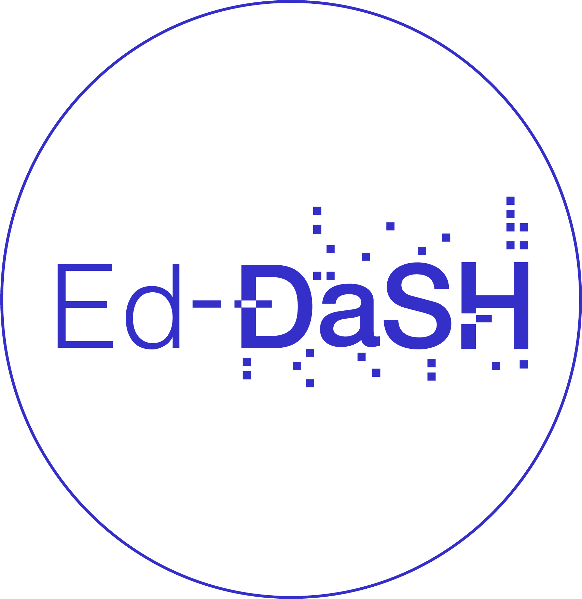

# FAIR for busy biologists Lesson

## General information

This lesson serves as the cornerstone for effectively integrating Open Science and FAIR principles into the management of biological research data. 

While our original lesson, [FAIR in bio practice](https://carpentries-incubator.github.io/fair-bio-practice/), has been highly praised by participants and received overwhelmingly positive feedback, its extensive duration spanning over 20 hours has resulted in low workshop participation rates.

Drawing from our insights and experiences, we have refined and condensed the content into a more accessible format. The updated version consists of two sessions, each lasting three hours, strategically focusing on essential skills and engaging exercises. This trimmed, streamlined approach aims to enhance the workshop experience and facilitate greater uptake among participants.

We [(the UoE BioRDM team)](https://www.wiki.ed.ac.uk/display/RDMS) have identified that a gap exists in the knowledge of how to apply FAIR principles to real-life day-to-day biological research. An understanding of the principles of good data management is just as important as the practicalities. Researchers must become conversant with the Open Science ethos, the Reproducible Research movement, and the FAIR principles, to explain their new skills and to recognize or evaluate them in their peers.

The overall goals of the lesson are: 
* To teach solid basic concepts in open science, FAIR guidelines and data management.
* To teach how to be FAIR in practice.
* To teach how to organize research workflows in such a way that it is easy to make biological research open, findable and reusable.

We are developing this lesson as part of the ED-DaSH consortium, supported by the "Data driven life science skills development - equipping society for the future" UKRI-MRC grant MR/V039075/1.

## Development status and contributing

The lesson is currently under active development. We welcome all contributions to improve the lesson! Maintainers will do their best to help you if you have any
questions, concerns, or experience any difficulties along the way.

We'd like to ask you to familiarize yourself with our [Contribution Guide](CONTRIBUTING.md) and have a look at
the [more detailed guidelines][lesson-example] on proper formatting, ways to render the lesson locally, and even
how to write new episodes.

Please see the current list of [issues][FIXME] for ideas for contributing to this
repository. For making your contribution, we use the GitHub flow, which is
nicely explained in the chapter [Contributing to a Project](http://git-scm.com/book/en/v2/GitHub-Contributing-to-a-Project) in Pro Git
by Scott Chacon.
Look for the tag . This indicates that the maintainers will welcome a pull request fixing this issue.

## Maintainer(s)

Current maintainers of this lesson are

* [Tomasz Zielinski](https://github.com/tzielins)

## Authors

A list of contributors to the lesson can be found in [AUTHORS](AUTHORS)

## Citation

To cite this lesson, please consult with [CITATION](CITATION)
