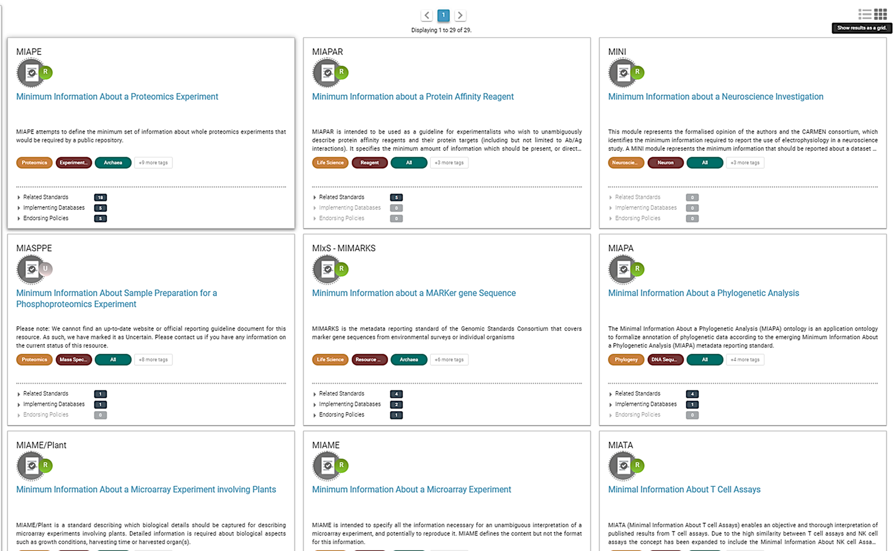

:::::::::::::::::::::::::::::::::::::: questions 

- What is metadata?
- What do we use metadata for?

::::::::::::::::::::::::::::::::::::::::::::::::

::::::::::::::::::::::::::::::::::::: objectives

- Recognize what metadata is
- Distinguish different types of metadata
- Know how to decide what to include in metadata

::::::::::::::::::::::::::::::::::::::::::::::::

(13 min teaching)

## What is (or are) metadata?

Simply put, metadata is data about the data. Sound confusing? Let's clarify: metadata is the *description of data*. It allows a deeper understanding of data and provides insight for its interpretation. Hence, your metadata should be considered as important as your data. Furthermore, metadata plays a very important role in making your data FAIR. It should be continuously added to your research data (not just at the beginning or end of a project!). Metadata can be produced in an automated way (e.g., when you capture a microscopy image, usually the accompanying software saves metadata as part of it) or manually.

<ins>Let's take a look at an example:</ins>

This is a confocal microscopy image of a *C. elegans* nematode strain used
as a proteostasis model (Pretty! Isn't it?). The image is part of the raw data
associated with [Goya et al., 2020](https://doi.org/10.1016/j.celrep.2019.12.078),
which was deposited in a Public Omero Server   
[Project](https://publicomero.bio.ed.ac.uk/webclient/?show=project-58)  
[Figure1 set](https://publicomero.bio.ed.ac.uk/webclient/?show=dataset-231)

*Figure credits: María Eugenia Goya*

What information **can you get** from the image, without the associated description (metadata)?

Let's see the associated metadata of the image and the dataset to which it belongs:

:::::::::::::::::::::::::::::::::::::::::::::::: callout

 ## Image metadata

 Name: OP50 D10Ad_06.czi  
 Image ID: 3485  
 Owner: Maria Eugenia Goya  
 ORCID: 0000-0002-5031-2470  

 Acquisition Date: 2018-12-12 17:53:55  
 Import Date: 2020-04-30 22:38:59  
 Dimensions (XY): 1344 x 1024  
 Pixels Type: uint16  
 Pixels Size (XYZ) (µm): 0.16 x 0.16 x 1.00  
 Z-sections/Timepoints: 56 x 1  
 Channels: TL DIC, TagYFP  
 ROI Count: 0  

 Tags: time course; day 10; adults; food switching; E. coli OP50;
 NL5901; C. elegans

 ## Dataset metadata

 Name: Figure2_Figure2B  
 Dataset ID:	263  
 Owner: Maria Eugenia Goya  
 ORCID: 0000-0002-5031-2470  

 Description:  
 The datasets contains a time course of α-syn aggregation in NL5901 C.
 elegans worms after a food switch at the L4 stage:

 E. coli OP50 to OP50  
 Day 01 adults  
 Day 03 adults  
 Day 05 adults  
 Day 07 adults  
 Day 10 adults  
 Day 13 adults  

 E. coli OP50 to B. subtilis PXN21  
 Day 01 adults  
 Day 03 adults  
 Day 05 adults  
 Day 07 adults  
 Day 10 adults  
 Day 13 adults  

 Images were taken at 6 developmental timepoints (D1Ad, D3Ad, D5Ad,
 D7Ad, D10Ad, D13Ad)

 \* Some images contain more than one nematode.

 Each image contains   ~30 (or more) Z-sections, 1 µmeters apart. The
 TagYFP channel is used to follow the alpha-synuclein particles. The TL
 DIC channel is used to image the whole nematode head.

 These images were used to construct Figure 2B of the Cell Reports
 paper (<https://doi.org/10.1016/j.celrep.2019.12.078>).

 Creation date: 2020-04-30 22:16:39

 Tags: protein aggregation; time course; E. coli OP50 to B. subtilis PXN21; food switching; E. coli OP50;
 10.1016/j.celrep.2019.12.078; NL5901; C. elegans

::::::::::::::::::::::::::::::::::::::::::::::::

This is a lot of information!

## Types of metadata

According to [How to FAIR](https://howtofair.dk/), we can distinguish between three main types of metadata:

* **Administrative metadata:** Data about a project or resource that is relevant for managing it; for example, project/resource owner, principal investigator, project collaborators, funder, project period, etc. They are usually assigned to the data before you collect or create them.
* **Descriptive or citation metadata:** Data about a dataset or resource that allows people to discover and identify it; for example, authors, title, abstract, keywords, persistent identifier, related publications, etc.
* **Structural metadata:** Data about how a dataset or resource came about, but also how it is internally structured. For example, the unit of analysis, collection method, sampling procedure, sample size, categories, variables, etc. Structural metadata have to be gathered by the researchers according to best practice in their research community and will be published together with the data.

Descriptive and structural **metadata should be added continuously** throughout the project.

### Examples of metadata

ere we have an Excel spreadsheet that contains project metadata for a made-up experiment of plant metabolites:

  
*Figure credits: Tomasz Zielinski and Andrés Romanowski*

Different types of metadata (administrative, descriptive, structural) are present in this example:

- Administrative metadata marked in blue
- Descriptive metadata marked in orange
- Structural metadata marked in green

Embedding metadata with your data as in the example is a very useful technique as the metadata remain joined to the data. As you can see, typically the metadata can be found in column headers (e.g., Strain, Media) or as key-value pairs (e.g., Funder, Protocols).

(6 min teaching)

Another form of storing metadata is the creation of a README file.

For example, check the README files of two datasets:

* [NMJ analysis](https://github.com/Boehmin/NMJ_analysis)
* [COVID wastewater data](https://github.com/BioRDM/COVID-Wastewater-Scotland)

Check what sections the readme files typically include.

:::: callout

## Where does data end and metadata start?

What is "data" and what is "metadata" can be a matter of perspective: Some researchers' metadata can be other researchers' data.

For example, a funding body is categorized as typical administrative metadata; however, it can be used to calculate numbers of public datasets per funder and then used to compare the effects of different funders' policies on open practices.

::::

## Adding metadata to your experiments

Good metadata is crucial for assuring the reusability of your outcomes. Adding metadata is also a very time-consuming process if done manually, so collecting metadata should be done incrementally during your experiment.

As we saw, metadata can take many forms, from as simple as including a ReadMe.txt file, embedding them inside the Excel files, to using domain-specific metadata standards and formats.

But,
* **What should be included in metadata?**
* **What terms should be used in descriptions?**

::::::::::::: challenge

## Exercise 1: What to include - discussion 
(5 minutes breakout + 7 discussing results)

Think of the data you generate in your projects,
and imagine you are going to share them.

What information would another researcher need to understand or reproduce your data (the structural metadata)?

For example, we believe that any dataset should have:

* a name/title
* its purpose or experimental hypothesis

Write down and compare your proposals, can we find some common elements?

::::::::::::: solution

## Solution

Some typical elements are:

* biological material, e.g. Species, Genotypes, Tissue type, Age, Health conditions
* biological context, e.g. speciment growth, entrainment, samples preparation
* experimental factors and conditions, e.g. drug treatments, stress factors
* primers, plasmid sequences, cell line information, plasmid construction
* specifics of data acquisition
* specifics of data processing and analysis
* definition of variables
* accompanying code, software used (version nr), parameters applied, statistical tests used, seed for randomisation
* LOT numbers

::::::::::::: 
::::::::::::: 

## Minimal Information Standard
For many assay methods and experiment types, there are defined recommendations and guidelines called **Minimal Information Standards (MIS)**.

The minimum information standard is a set of guidelines for reporting data derived by relevant methods in the biosciences. Following these guidelines ensures that the data can be easily:

* **Verified**
* **Analyzed**
* **Clearly interpreted** by the wider scientific community.

Adhering to these recommendations also facilitates the foundation of:

* Structured databases
* Public repositories
* Development of data analysis tools

Individual minimum information standards are developed by communities of cross-disciplinary specialists focused on specific methods used in experimental biology.

**Minimum Information for Biological and Biomedical Investigations (MIBBI)** [MIBBI](https://fairsharing.org/collection/MIBBI) is the collection of the most well-known standards.

  
Figure. Some of the MIBBI minimum information standards from fairsharing.org

[FAIRSharing](https://fairsharing.org/standards/) offers excellent search service
for finding standards

::::::::::::: challenge

## Exercise 2: Minimal information standard example (5 min)
(about 4 + 2 discussion)

Look at the document titled "**Minimum Information About a Neuroscience Investigation (MINI) Electrophysiology**" (Gibson, F. et al. Nat Prec (2008): [https://www.nature.com/articles/npre.2008.1720.1.pdf](https://www.nature.com/articles/npre.2008.1720.1.pdf)), which contains recommendations for reporting the use of electrophysiology in a neuroscience study.  
(*Neuroscience (or neurobiology) is the scientific study of the nervous system*).

 Scroll to *Reporting requirement* and decide which of the points 1-8 are:

 * a) important for understanding and reuse of data
 * b) important for technical replication
 * c) could be applied to other experiments in neuroscience

::::::::::::: solution

 Possible answers:

 * a) 2, 3, 4, 5, 6, 8a-b 
 * b) 3, 7
 * c) 2, 3, 4, 5, 6 

::::::::::::: 
::::::::::::: 

(3 min)

## Metadata and FAIR guidelines

Metadata provides extremely valuable information for us and others to be able to interpret, process, reuse, and reproduce the research data it accompanies.

Since metadata is data about data, all of the FAIR principles (Findable, Accessible, Interoperable, and Reusable) apply to it.

Ideally, metadata should be not only machine-readable but also interoperable so that computer systems can interlink or reason about it.

## Attribution
    
     Content of this episode was adapted from:

     - [Metadata - FAIR data for climate sciences](https://escience-academy.github.io/Lesson-FAIR-Data-Climate/metadata/index.html).
     - [Metadata - How to FAIR](https://howtofair.dk/how-to-fair/metadata/)
     - [MIBBI](https://fairsharing.org/collection/MIBBI)

:::::::::::::::::::::::::::::::::::::::::::::::: keypoints

- Metadata provides contextual information so that other people can understand the data.
- Metadata is key for data reuse and complying with FAIR guidelines.
- Metadata should be added incrementally through out the project

::::::::::::::::::::::::::::::::::::::::::::::::
